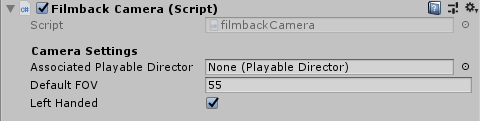
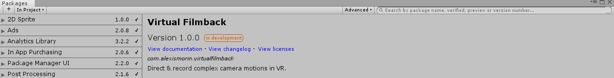

This intermittent mashing of *GameObject/Align With View* to key camera positions must cease! This Unity package allows you to instance yourself into your Unity scene and record camera movements in a more precise, true-to-life fashion. Convenient for rendered real-time video, game cutscenes and camera blocking alike!

This package contains only a camera prefab and not a full-locomotion system (for now) -  it can be installed on top of any project with pre-installed VR integration so that you can devise your own large scale movement schemes, whether it be Cloverfield-esque foot movement or dolly translations. It uses Unity's native XR library, so unless you're running a cardboard rig it should work.

### Control Scheme
- Trigger button: Hold to record.
- Grip button: Play & pause the current timeline.

### Workflow

- If you are left-handed, mark the checkbox as such - this will adjust the position of the camera viewport for you (yes, I only made this because I'm left handed myself).
- Assign a playable director in your scene to the playable director slot - you'll be able to pause and play your Timeline to give yourself some time to reposition yourself between shots.
- Set the inital field of view for your camera (50-55 is a good setting for film 7 TV but you can increase it higher if you're recording cutscenes for a skateboard game) - In a future version I plan of having a button to easily snap back to this preset FOV.

### Dependencies & Requirements
- Unity 2019.1 or later
- Have "Virtual Reality Supported" enabled in your XR Settings for that Unity Project.
- Package Manager Version of the Unity Recorder
- A VR headset with motion controllers (Tested on Oculus Rift CV1, ought to work with the HTC Vive + Wands and maybe with WMR headsets)

### Install process

This is a plugin that makes use of Unity's new *Package Manager* feature. Just drop the *com.alexismorin.virtualfilmback* folder into your *packages* folder (found at the same level as your Assets folder) and it should work out-of-the-box. If you're using an older version of Unity (not supported here, but can be made to work if you're courageous), take the *com.alexismorin.virtualfilmback* folder and then drag it anywhere into your regular project hierarchy.

### Todo
- FOV adjustment for zoom ins and outs.
- Dolly-like movement scheme to increase possible recording range.
- On-foot movement scheme to increase possible recording range.
- Flying movement scheme to increase possible recording range.

Per usual, try and enjoy in spite of all the bugs!

(Monstly) crafted in a few hours at [Imaginary Spaces](https://imaginary-spaces.com/) while waiting for other packages to import.
